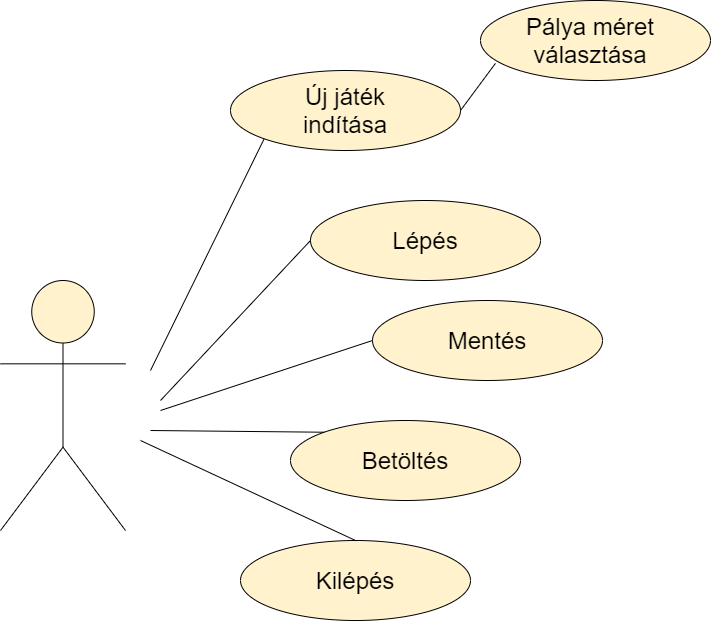
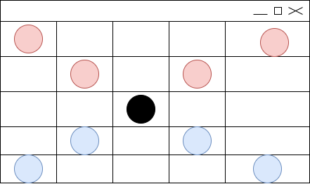
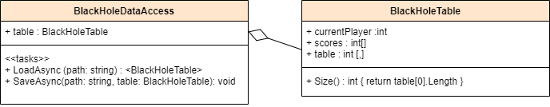
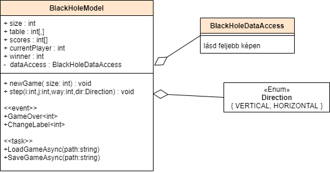
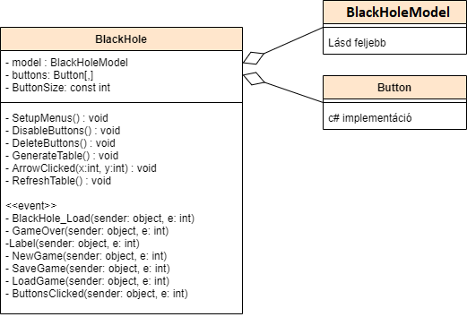

# Black Hole Game

- [The English version is below](#english-version)

## **Készítette**

hipirobi  
C#, Visual Studio 2019, WinForms  
2020. december

## **Feladat**

Készítsünk programot, amellyel a következő két személyes játékot lehet játszani. Adott egy 𝑛 × 𝑛 mezőből álló tábla, amelyen két játékos űrhajói helyezkednek el, középen pedig egy fekete lyuk. A játékos 𝑛 − 1 űrhajóval rendelkezik, amelyek átlóban helyezkednek el a táblán (az azonos színűek egymás mellett, ugyanazon az oldalon). A
játékosok felváltva léphetnek. Az űrhajók vízszintesen, illetve függőlegesen mozoghatnak a táblán, de a fekete lyuk megzavarja a navigációjukat, így nem egy mezőt lépnek, hanem egészen addig haladnak a megadott irányba, amíg a tábla széle, a fekete lyuk, vagy egy másik, előtte lévő űrhajó meg nem állítja őket (tehát másik űrhajót átlépni nem lehet). Az a játékos győz, akinek sikerül űrhajóinak felét eljuttatnia a fekete lyukba. A program biztosítson lehetőséget új játék kezdésére a pályaméret megadásával (5 × 5, 7 × 7, 9 × 9), valamint játék mentésére és betöltésére. Ismerje fel, ha vége a játéknak, és jelenítse meg, melyik játékos győzött.

## A feladat elemzése

A játékot 2 játékos játszhatja, akik felváltva léphetnek az űrhajóikkal, de a program szempontjából mindig csak egy játékos van. A játékot 5x5-ös,7x7-es vagy 9x9-es mezőn lehet játszani és a program alapból egy 5x5-ös mezőt állít be.

## **Felhasználói felület terve**

## **Tervezés**

- Programszerkezet:
  - A programot háromrétegű architektúrában valósítjuk meg. A megjelenítés a View, a modell a Model, míg a perzisztencia a Persistence névtérben helyezkedik el.
- Perzisztencia:
  - Ebben két osztályt hozunk létre. Egy DataAccess osztályt ami kezeli a megnyitást és mentést, illetve egy Table osztályt ami tárolja a játékállás pontjait(mint például melyik játékos következik, táblán mi és hol helyezkedik el ).
  
- Modell:
  - A modellben egy osztályt és egy Enumot implementálunk. Ebben tároljuk a fontos adatokat. Innen küldünk eseményeket a nézetnek.
  
- Nézet:
  - Nézetért egy osztály a felelős. Az események ide érkeznek be. Ez a fő osztály, ezért itt létrehozunk egy modell példányt.
  

## **Tesztelés**

A modell funkcionalitása egységtesztek segítségével lett ellenőrizve a **BlackHoleTest** osztályban. Az alábbi tesztesetek kerültek megvalósításra:

- **InitializeFine**: elindít több játékot és ellenőrzi, hogy minden jó helyen van, megfelelő darabszámban.
- **TestStep**: elindít egy játékot és teszteli, hogy jól lép-e a hajó. Jó helyre, a helyét jól törli és ha feketelyukba megy akkor „eltűnik”.

## English version

## **Author**

hipirobi  
C#, Visual Studio 2019, WinForms  
2020. december

## **Task**

Implement the following two-person game. Given a board of n X n with two player's spaceships and a black hole in the middle of it. Each player has n-1 spaceships that are located diagonally on the board. (spaceships of the same color are next to each other on tha same side of the board).
Players take turns to step with one of theirs spaceships. Spaceships can move horizontally or vertically on the board. The black hole interfere with their navigation, so they will move in the specified direction until the edge of the board, the black hole or another spaceship.(they can not cross another spaceship). The player who manages to get half of his spaceships into the black hole wins. The program should allow you to start a new game by giving the board size (5x5, 7x7 or 9x9), save and load the game. The application should recognize when the game is over and show which player won.

## **Analysis of the task**

The game can be played by 2 players who can take turns to step with their spaceships. For the program there is always only one player at a time.(becasue players take turns). The game can be player on a 5x5, 7x7 or 9x9 board and the program sets the size of the board to 5x5 by default.

## **Wireframe**

## **Implementation plan**

- Structure:
  - The program will be implemented in a three layer architecture. The view is in the View, the model in the Model, and the persistence in the Persistence namespace.
- Persistence:
  - We implement two classes. A DataAccess class that handles opening and saving a game, and a Table class that stores the game informations.(shuch as which player is next, what is on the board and where is it).
  
- Model:
  - In the model, we implement a class and an enum. This is where we store important data. From here, we send events to the View.
  
- View:
  - One class is responsible for the view. It handles the events. This is tha main class of the program so here we create a model instance.
  

## **Testing**

The functionality of the model was verified using unit tests in the **BlackHoleTest** clas. The following test cases were implemented:

- **InitializeFine**: starts a few game and tests that everything is in the right position with the right quantity.
- **TestStep**: starts a single game and tests that the spaceship steps well. ( right position, inside the black hole it "disappears").
